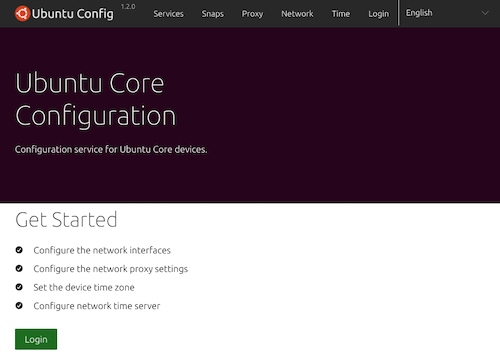
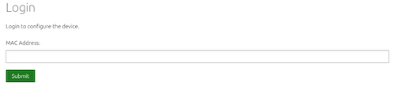
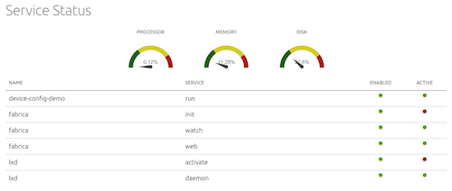
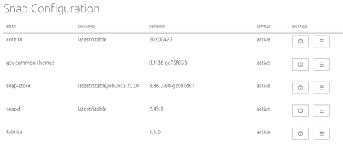
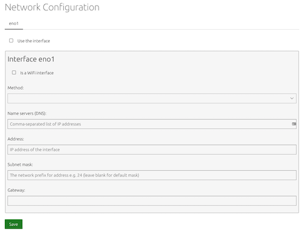
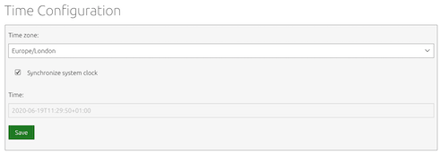

# Web Interface

## Login
Users need to login to be able to configure the device.

The authentication uses the MAC address of the device (usually printed on the device).

## Service status
The status of the device and the services that are running.

## Application configuration
A list of the installed applications and configuration of their settings.

## Network configuration
The configuration of the network interfaces of the device.

## Proxy configuration
The configuration of the network proxy settings.

## Time configuration
The configuration of the time settings for the device.

